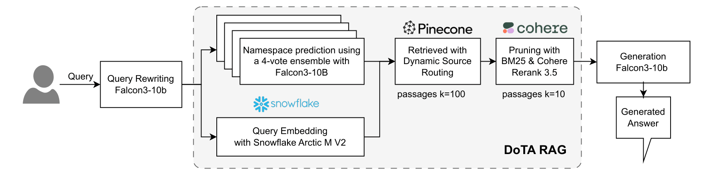

# DoTA-RAG: Dynamic of Thought Aggregation RAG


**Citation**
```bash
@misc{ruangtanusak2025dotaragdynamicthoughtaggregation,
      title={DoTA-RAG: Dynamic of Thought Aggregation RAG}, 
      author={Saksorn Ruangtanusak and Natthapath Rungseesiripak and Peerawat Rojratchadakorn and Monthol Charattrakool and Natapong Nitarach},
      year={2025},
      eprint={2506.12571},
      archivePrefix={arXiv},
      primaryClass={cs.CL},
      url={https://arxiv.org/abs/2506.12571}, 
}
```

